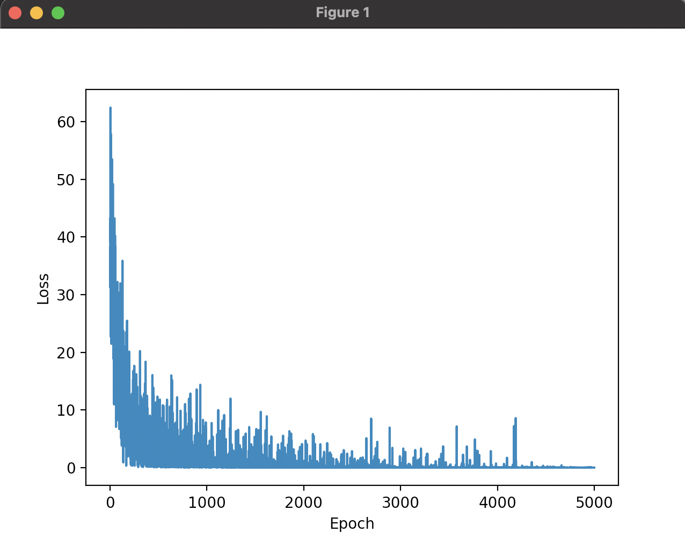
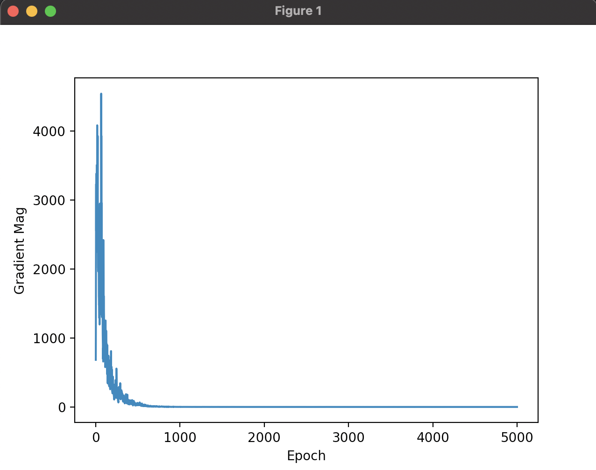
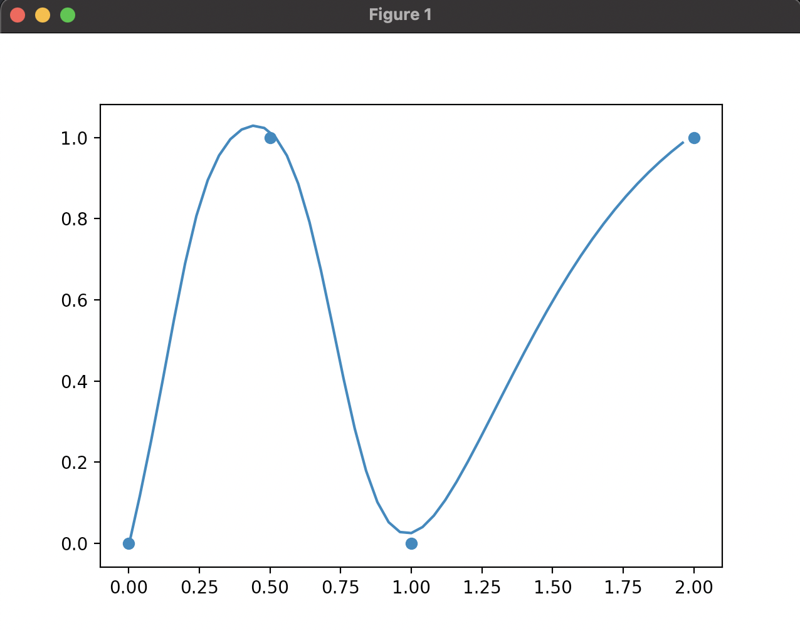
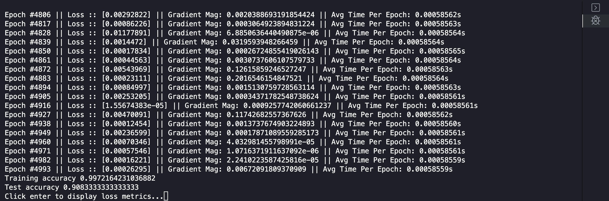

# Neural Network Library

A neural network library made using python and numpy

# Features
  -
      - A Tensorflow like interface to construct models with a variety of different layer types
      - Layer types such as: Dense, Convolutional, MaxPool, AveragePool, and Flatten
      - Graphing of loss data after training:  
      - Graphing of gradient magnitude data after training:  
      - Graphing of a model's fit to 2D data: 
      - Saving and loading of models to text files
      - Printing of debug information on every 'n' epochs 

 # Performance
   -
      - Up to 99% test set accuracy on 8x8 mnist dataset with 10 output classes with all dense layers
      - Up to 99% test set accuracy on 8x8 mnist dataset with 3 output classes with convolutional network
      
 # Loss Functions
   -
      - Least Squares
      - Cross Entropy

 # Activation Functions
   -
      - Relu
      - Sigmoid
      - Hyperbolic Tangent
      - Softplus
      - Softmax

 # Note
    Convolutional Neural Networks have to be limited in their size since all the computation in this project takes place on the CPU.
    As they are now, they are very slow